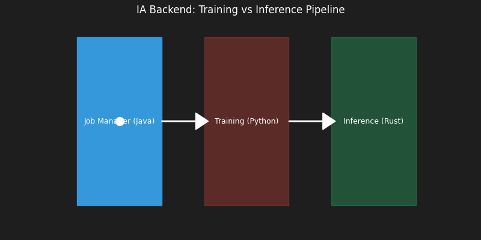

# Backend de IA "Bare-Metal" (No-Framework)

> **"Inferencia de IA sin el peso de Docker ni Python en runtime."**



## ❓ El Problema Real
Desplegar modelos de IA en producción suele ser ineficiente.
*   **Python** es lento para servir peticiones HTTP concurrentes (GIL).
*   **TensorFlow/PyTorch** son librerías gigantescas (>500MB) difíciles de desplegar en entornos ligeros.

## 🛠 La Solución Arquitectónica
Un servidor de inferencia desde cero que elimina la dependencia de Python en producción:

1.  **Python (Solo Entrenamiento)**: Se usa para diseñar y entrenar la red neuronal. Exporta los pesos a un formato binario simple (`weights.bin`).
2.  **Java (API Gateway)**: Recibe las peticiones REST y gestiona la cola de trabajos.
3.  **Rust (Motor de Inferencia)**: Carga `weights.bin` y ejecuta la multiplicación de matrices usando instrucciones vectoriales (SIMD) de la CPU.

### ¿Por qué no usar TorchServe?
Esta implementación demuestra cómo construir un motor de inferencia personalizado para sistemas embebidos o de latencia crítica donde no puedes permitirte el overhead de un framework completo.

## ⚙️ Cómo Ejecutar
El script `manage.py` orquesta el entrenamiento (si es necesario) y la ejecución:

```bash
python ../manage.py run ia
```

## 📈 Escalabilidad
Al desacoplar el servidor HTTP (Java) del cómputo (Rust), podemos ajustar el número de hilos de inferencia independientemente de las conexiones de red, maximizando el uso de la CPU.
