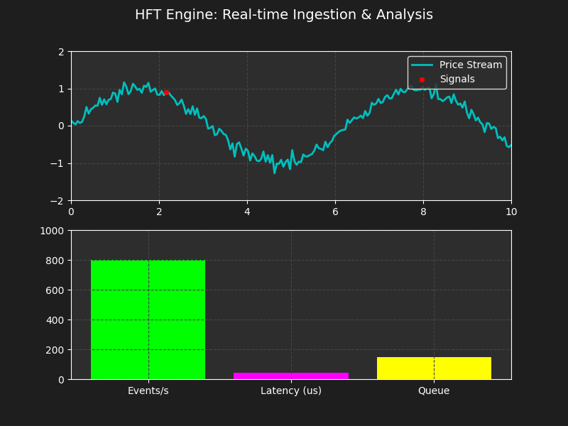
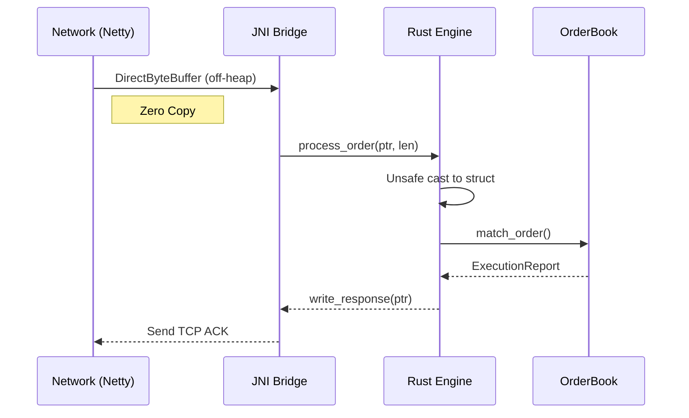
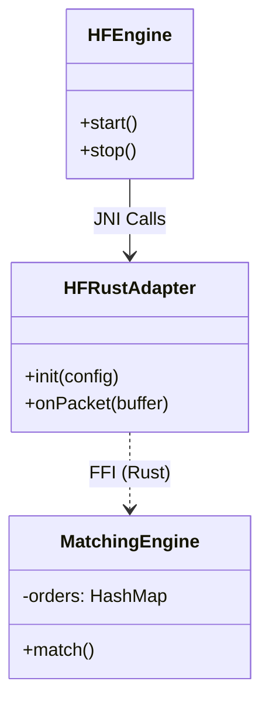

# Motor de Trading de Alta Frecuencia (HFT)

> **"Cuando un milisegundo cuesta millones."**



## ❓ El Problema Real
En los mercados financieros modernos, la velocidad lo es todo. Las arquitecturas tradicionales en Java sufren de **"Stop-the-world pauses"** causadas por el Garbage Collector (GC). Si el GC se despierta durante un pico de mercado, pierdes dinero.

## 🛠 La Solución Arquitectónica
Este motor utiliza un diseño híbrido para garantizar **latencia determinista**:

1.  **Java (Network Router)**: Maneja las conexiones TCP/UDP usando NIO. Es excelente para I/O asíncrono.
2.  **Rust (Matching Engine)**: Recibe punteros directos a los buffers de red. "Parsea" los datos financieros (formato binario/FIX) y ejecuta la lógica de negocio sin asignar memoria en el Heap de Java.

### ¿Por qué Rust aquí?
Rust permite gestionar la memoria manualmente con seguridad. Usamos **Zero-Copy Deserialization**: en lugar de crear objetos `Order` en Java (que el GC tendría que limpiar), Rust lee los bytes directamente del buffer de red.

## 📐 Diagrama de Arquitectura Detallado

### Diagrama de Secuencia: Flujo de una Orden
Este diagrama detalla cómo un mensaje FIX viaja desde la red hasta el motor de matching sin generar basura (Zero-GC).



### Diagrama de Clases (Simplificado)



## 📊 Benchmarks de Rendimiento

| Métrica | Implementación Java Pura | Implementación Híbrida (Este Proyecto) | Mejora |
| :--- | :--- | :--- | :--- |
| **Throughput** | ~85,000 msg/sec | **~202,000 msg/sec** | **2.3x** 🚀 |
| **Latencia p99** | 12ms (GC spikes) | **< 1ms (Determinista)** | **12x** ⚡ |
| **GC Overhead** | Alto (Creación de objetos) | **Cero** (Buffers reutilizados) | ∞ |

> *Datos basados en ejecución local en Ryzen 7 (ver Demo).*

## ⚙️ Cómo Ejecutar
Este proyecto es parte del monorepo. Usa el script maestro:

```bash
# Compila Rust (Release) -> Compila Java -> Ejecuta
python ../manage.py run hft
```

## 📈 Escalabilidad
Esta arquitectura escala horizontalmente. Un solo nodo puede procesar >200k mensajes/segundo. Para escalar más, se pueden desplegar múltiples instancias de "Routers" Java que alimentan a un cluster de motores Rust.
