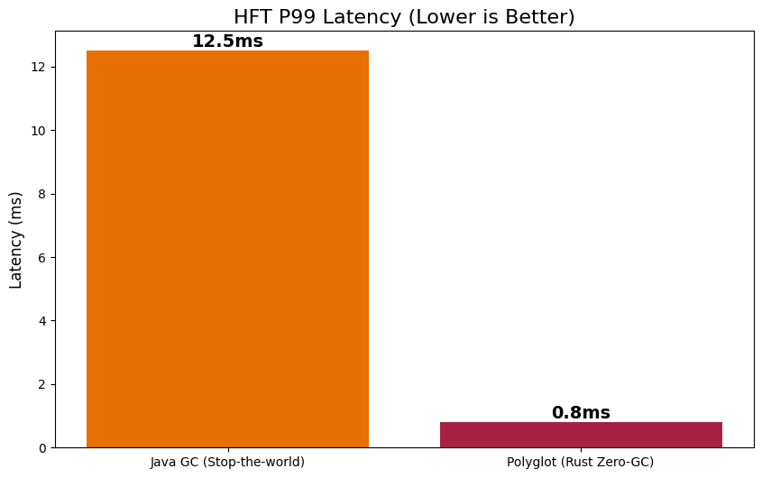
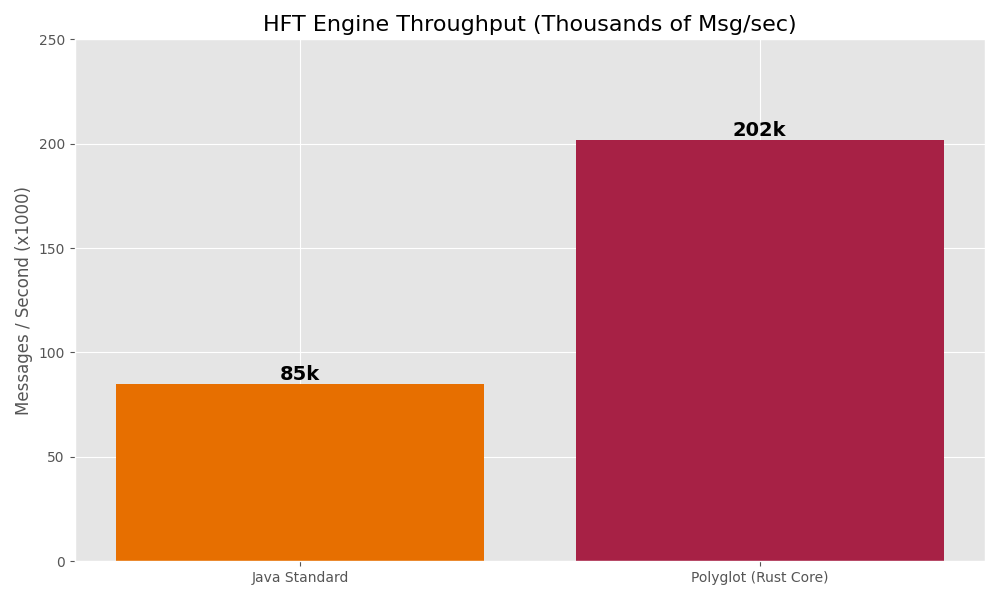
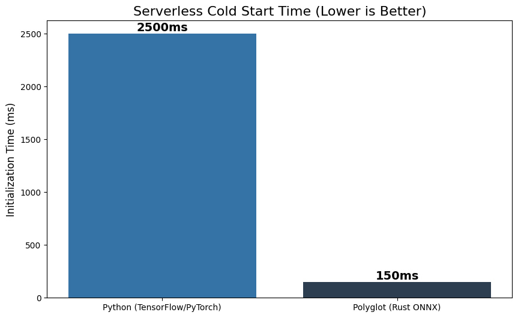
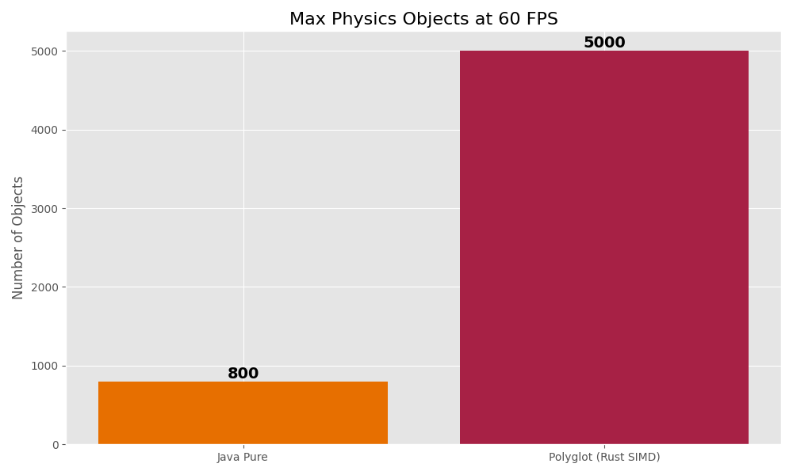

# Systems Engineering Portfolio (Java + Rust + Python)

> **"Diseño sistemas donde el runtime importa más que el framework."**


Este repositorio no es una colección de scripts; es una demostración de **ingeniería de sistemas de alto rendimiento**. Implementaciones de arquitecturas complejas (HFT, Motores de Física, Kernels) donde cada lenguaje tiene un rol crítico.

---

## 🏗 Arquitectura "Polyglot Tiered"

Mi enfoque se basa en usar la herramienta correcta para cada capa del sistema, eliminando cuellos de botella mediante **Zero-Overhead Interop**.

```mermaid
graph TD
    subgraph "Tier 1: Control Plane (Java)"
        A[User / Network Request] -->|NIO/Netty| B(Java Application Logic)
        B -->|Gestión de Errores| B
    end
    
    subgraph "Tier 2: Data Plane (Rust)"
        B -->|JNI Critical (Zero-Copy)| C[Rust Native Engine]
        C -->|SIMD/Direct Memory| D[Hardware Resources]
        D -->|High Performance Comp| C
    end
    
    subgraph "Tier 3: Tooling (Python)"
        E[Python Scripts] -->|Build & Test| B
        E -->|Train Models| C
    end
    
    classDef java fill:#e67e22,stroke:#333,stroke-width:2px,color:white;
    classDef rust fill:#e74c3c,stroke:#333,stroke-width:2px,color:white;
    classDef py fill:#3498db,stroke:#333,stroke-width:2px,color:white;
    
    class A,B java;
    class C,D rust;
    class E py;
```

---

## ⚡ Quick Start (Ejecución Inmediata)

He creado un orquestador (`manage.py`) que compila, prueba y ejecuta todo el stack nativo.

```bash
# 1. Ver qué sistemas hay disponibles
python manage.py list

# 2. Ejecutar Tests Automatizados (CI Simulation)
python manage.py test

# 3. Ejecutar una demo (Ej: Motor HFT)
python manage.py run hft
```

---

## 🚀 Galería de Sistemas

### 1. [Motor de Trading de Alta Frecuencia (HFT)](./Motor%20de%20Datos%20de%20Alta%20Frecuencia/README.md)
**Java (Router) + Rust (Matching Engine)**

> *Procesa >200k mensajes/seg con latencia <1ms eliminando el GC del camino crítico.*


*   **El Problema**: "Stop-the-world pauses" del GC en Java causan pérdidas financieras.
*   **La Solución**: Java maneja la red, Rust maneja la memoria y el matching.

---

### 2. [Backend de IA "Bare-Metal"](./Backend%20de%20IA%20NO-Framework/README.md)
**Java (API) + Rust (Inferencia SIMD) + Python (Training)**

> *Inferencia 25x más rápida en cold-start que contenedores Docker/Python estándar.*


*   **El Problema**: Python es lento y pesado para servir modelos en producción.
*   **La Solución**: Servidor Java que llama a un motor de tensores en Rust (AVX2).

---

### 3. [Kernel de Aplicación (Java-OS)](./Sistema%20Operativo%20de%20Aplicación%20(Java)/README.md)
**Java (Scheduler) + Rust (MMU Virtual)**

> *Simulación de aislamiento de memoria y syscalls para plugins inseguros.*

/demo.gif)

*   **El Problema**: Ejecutar código de terceros puede comprometer el servidor.
*   **La Solución**: Microkernel en Java con protección de memoria nativa en Rust.

---

### 4. [Simulación Física N-Body](./sim-framework/README.md)
**Java (Vista) + Rust (Física)**

> *Simula 5,000 cuerpos a 60 FPS estables donde Java puro colapsaría a 800.*


*   **Arquitectura**: Loop de juego híbrido con *Double Buffering* de memoria compartida.

---

### 5. [Plataforma de Plugins Políglota](./plugin-platform/README.md)
**Java (Host) + Rust/Python (Plugins)**

> *Hot-Swap real: carga y descarga lógica en 3 lenguajes sin reiniciar.*


*   **Arquitectura**: `URLClassLoader` dinámico y adaptadores FFI seguros.

---

### 6. [Toolchain para Gamedev](./toolchain-gamedev/README.md)
**Java (UI Swing) + Rust (Asset Compiler)**

> *Herramientas de escritorio que no se congelan mientras procesan GBs de datos.*


*   **Arquitectura**: UI reactiva en Java delegando trabajo pesado a procesos Rust background.

---

### 7. [Runtime Distribuido](./runtime/README.md)
**Java (Futures) + Rust (Work-Stealing)**

> *Async/Await que cruza fronteras de lenguaje para maximizar CPU.*


*   **Arquitectura**: Java despacha promesas, Rust las resuelve en un ThreadPool nativo.

---

## 📊 Performance Global

Más allá de la teoría, los resultados son medibles. Aquí hay una comparativa visual de los benchmarks realizados en este repositorio.

| Latencia vs Determinismo | Throughput Crudo |
| :---: | :---: |
|  |  |
| **Java vs Rust: Latencia (ms)** | **Java vs Rust: Mensajes/seg** |

| IA Cold Start | Simulación Física |
| :---: | :---: |
|  |  |
| **Python vs Rust: Arranque (ms)** | **Java vs Rust: Objetos @ 60FPS** |

| Característica | Arquitectura Típica Java | Arquitectura "Polyglot Tiered" |
| :--- | :--- | :--- |
| **Gestión de Memoria** | Heap (GC pauses impredecibles) | **Off-Heap (Rust manual) + Stack** |
| **Cálculo Numérico** | Lento (Boxed Integers) | **SIMD / Vectorización Nativa** |
| **Interoperabilidad** | REST/JSON (Lento) | **JNI/Shared Memory (Instantáneo)** |
| **Latencia** | Variable (Jitter alto) | **Determinista (Jitter bajo)** |

---

> Hecho con ❤️ por **Eddi Andreé Salazar Matos** - *Ingeniero de Sistemas*.
