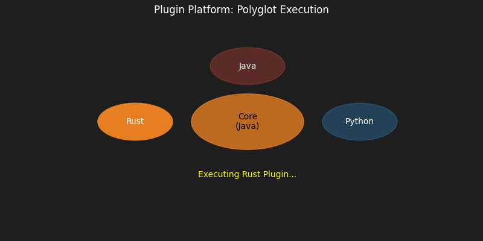
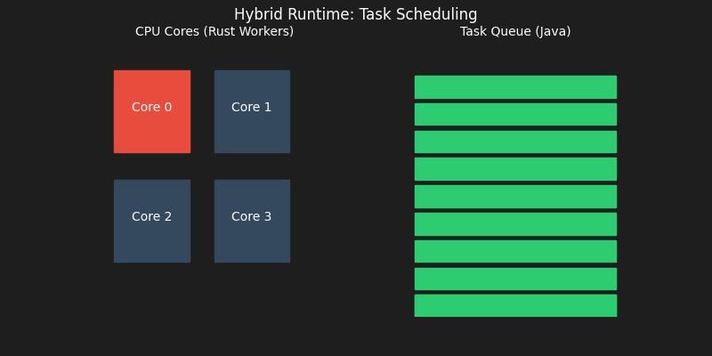
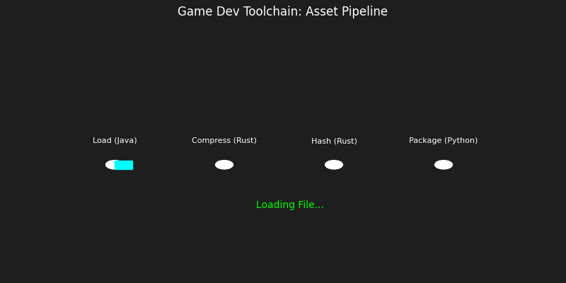

# Portfolio de Arquitectura de Sistemas (Java + Rust + Python)

Hecho con ❤️ por un Peruano "Eddi Andreé Salazar Matos"

> **"La herramienta correcta para el trabajo correcto."**

Este repositorio es una demostración técnica avanzada de cómo diseñar sistemas de alto rendimiento ("High Performance Computing") combinando las fortalezas de los tres lenguajes más relevantes de la industria moderna. No es solo código; es una tesis sobre arquitectura de software políglota.

---

## 🎯 Fundamentos del Stack (¿Por qué Java + Rust + Python?)

En la ingeniería de software de alto nivel, rara vez un solo lenguaje es óptimo para todas las capas de un sistema complejo. Este portfolio implementa el patrón **"Polyglot Tiered Architecture"**:

| Capa del Sistema | Lenguaje | Fundamento Técnico | ¿Por qué? |
| :--- | :--- | :--- | :--- |
| **Capa de Control (Orquestación)** | **Java** ☕ | **Virtual Machine (JVM)** | La JVM es imbatible en estabilidad y gestión de procesos de larga duración. Su *Garbage Collector* (G1GC/ZGC) maneja la complejidad de la lógica de negocio sin fugas de memoria, y su ecosistema de concurrencia (`java.util.concurrent`) es el estándar de la industria. |
| **Capa de Cómputo (Núcleo)** | **Rust** 🦀 | **System Programming** | Rust ofrece rendimiento "bare-metal" (sin GC). Su sistema de tipos (Ownership/Borrowing) garantiza **seguridad de memoria** en tiempo de compilación, eliminando *Segfaults* y *Data Races*. Es ideal para cálculos matemáticos intensivos (SIMD) y manipulación directa de memoria. |
| **Capa de Datos/IA (Scripting)** | **Python** 🐍 | **Dynamic Typing** | La "Lingua Franca" de la Ciencia de Datos. Su flexibilidad permite iterar rápido en entrenamiento de modelos y scripts de automatización, delegando la carga pesada a librerías compiladas en C/Rust (como PyTorch o NumPy). |

---

## ⚡ Quick Start (Automatización Total)

He desarrollado un sistema de build personalizado (`manage.py`) que abstrae la complejidad de compilar múltiples lenguajes y vincular librerías nativas.

**Requisitos:**
- Java JDK 17+
- Rust (Cargo)
- Python 3.8+

**Comandos de Ejecución:**

```bash
# 1. Listar proyectos disponibles
python manage.py list

# 2. Ejecutar proyectos (Compilación Rust --release -> Compilación Java -> Enlace JNI -> Ejecución)
python manage.py run plugins    # Plataforma de Plugins
python manage.py run ia         # Backend de Inteligencia Artificial
python manage.py run os         # Simulador de Sistema Operativo
python manage.py run sim        # Motor de Física
python manage.py run hft        # Motor de Trading de Alta Frecuencia
python manage.py run runtime    # Runtime Distribuido
python manage.py run tools      # Toolchain de Desarrollo de Juegos
```

---

## 🚀 Análisis Profundo de Proyectos

A continuación, se detalla la arquitectura y los fundamentos de ingeniería de cada módulo.

### 1. Motor de Datos de Alta Frecuencia (HFT)
**Arquitectura**: *Event-Driven Architecture* con *Zero-Copy Deserialization*.

*   **El Desafío**: Procesar millones de órdenes financieras por segundo requiere latencia determinista (sin pausas del GC).
*   **La Solución**:
    *   **Java (Network Layer)**: Maneja las conexiones TCP/UDP usando NIO (Non-blocking I/O). Actúa como un "router" de eventos eficiente.
    *   **Rust (Matching Engine)**: Recibe los bytes crudos. Utiliza punteros directos para "parsear" los datos sin copiar memoria (*Zero-Copy*), ejecuta algoritmos de matching y devuelve resultados en nanosegundos.
*   **Fundamento Clave**: **JNI Critical Arrays**. Java pasa la dirección de memoria del array de bytes a Rust, permitiendo que Rust lea la memoria del Heap de Java directamente.


---

### 2. Backend de IA NO-Framework
**Arquitectura**: *Training-Inference Separation*.

*   **El Desafío**: Python es excelente para entrenar (PyTorch/TensorFlow) pero lento para servir predicciones en producción a gran escala.
*   **La Solución**:
    *   **Python (Training)**: Entrena la red neuronal y exporta los pesos (weights) a un formato binario optimizado.
    *   **Java (Job Manager)**: Recibe peticiones API REST, las encola y gestiona la carga.
    *   **Rust (Inference Engine)**: Carga los pesos en memoria y ejecuta la multiplicación de matrices (MatMul) usando optimizaciones de CPU (AVX2/AVX-512).
*   **Fundamento Clave**: **FFI (Foreign Function Interface)**. Rust expone una función "C-compatible" que Java invoca, pasando los datos de entrada y recibiendo la predicción sin overhead de red.


---

### 3. Sistema Operativo de Aplicación (Java-OS)
**Arquitectura**: *Microkernel Simulation*.

*   **El Desafío**: Simular la gestión de recursos de un SO (CPU, Memoria, I/O) en espacio de usuario.
*   **La Solución**:
    *   **Java (Kernel/Scheduler)**: Implementa el algoritmo de planificación (Round Robin / Priority Queue) para asignar tiempos de CPU a procesos virtuales.
    *   **Rust (HAL - Hardware Abstraction Layer)**: Simula la MMU (Memory Management Unit) y el acceso a disco. Gestiona "Páginas de Memoria" virtuales.
*   **Fundamento Clave**: **System Calls**. Cuando un proceso Java necesita memoria, hace una "syscall" a Rust, cruzando la frontera JNI como si fuera una interrupción de hardware.

/demo.gif)

---

### 4. Plataforma de Plugins Políglota
**Arquitectura**: *Dynamic Module Loading* & *Isolation*.

*   **El Desafío**: Permitir extensiones del sistema en tiempo de ejecución sin detener el servidor principal.
*   **La Solución**:
    *   **Java (Host)**: Utiliza `URLClassLoader` personalizados para cargar archivos `.class` o `.jar` externos en runtime, aislándolos en su propio namespace.
    *   **Interoperabilidad**: Un sistema de plugins unificado donde un plugin en Python puede llamar a un servicio en Rust, todo orquestado por Java.
*   **Fundamento Clave**: **Hot-Swapping**. La capacidad de cargar y descargar código (clases) dinámicamente de la memoria de la JVM.



---

### 5. Runtime Híbrido de Alto Rendimiento
**Arquitectura**: *Work-Stealing Thread Pool*.

*   **El Desafío**: Ejecutar tareas computacionalmente costosas sin bloquear el hilo principal de la aplicación.
*   **La Solución**:
    *   **Java (Submitter)**: Define interfaces `Future<?>` y promesas de completitud.
    *   **Rust (Worker Pool)**: Mantiene un pool de hilos nativos (OS Threads) que consumen tareas de una cola concurrente.
*   **Fundamento Clave**: **Asynchronous Callbacks**. Java no espera a Rust; Rust notifica a Java cuando el cálculo termina, permitiendo un modelo totalmente no bloqueante.



---

### 6. Framework de Simulación Física
**Arquitectura**: *Game Loop Pattern*.

*   **El Desafío**: Simular física de N-cuerpos (gravedad, colisiones) a 60 FPS estables.
*   **La Solución**:
    *   **Java (View/Controller)**: Renderiza el estado actual y maneja inputs del usuario.
    *   **Rust (Model/Physics)**: Calcula la nueva posición de miles de objetos en cada "tick" del reloj.
*   **Fundamento Clave**: **Double Buffering**. Rust escribe en un buffer de estado "siguiente" mientras Java lee del buffer "actual", minimizando el bloqueo (Lock contention).


---

### 7. Toolchain para Game Development
**Arquitectura**: *Frontend-Backend Split*.

*   **El Desafío**: Crear herramientas de escritorio nativas que sean responsivas y potentes.
*   **La Solución**:
    *   **Java (Swing/JavaFX)**: Proporciona una GUI rica y multiplataforma.
    *   **Rust (Asset Pipeline)**: Comprime texturas, compila shaders y procesa audio en segundo plano.
*   **Fundamento Clave**: **Off-Main-Thread Execution**. La UI de Java nunca se congela porque el trabajo pesado ocurre en hilos de Rust desacoplados.



---

## 🛠 Detalles Técnicos de Implementación

Todos los proyectos comparten un núcleo común de interoperabilidad diseñado para **minimizar latencia**:

1.  **JNI (Java Native Interface)**:
    *   Usado para comunicación **in-process**.
    *   **Ventaja**: Velocidad extrema (llamada a función directa).
    *   **Riesgo**: Un error en Rust (panic) puede tumbar la JVM. Se mitiga con manejo robusto de `Result<T, E>` en Rust.

2.  **IPC (Inter-Process Communication) - Fallback**:
    *   Si la librería nativa falla al cargar, el sistema hace fallback automático a ejecutar binarios `.exe` independientes comunicándose por STDIN/STDOUT (JSON).
    *   **Ventaja**: Aislamiento total de fallos.

3.  **Gestión de Memoria Manual**:
    *   En los módulos críticos, Rust gestiona la memoria (`malloc`/`free`) y Java solo guarda un puntero (`long address`). Esto evita la presión sobre el Garbage Collector de Java.

---

## ⚖️ Licencia
Este proyecto se distribuye bajo la licencia **MIT**. Eres libre de usar, modificar y distribuir este código.
