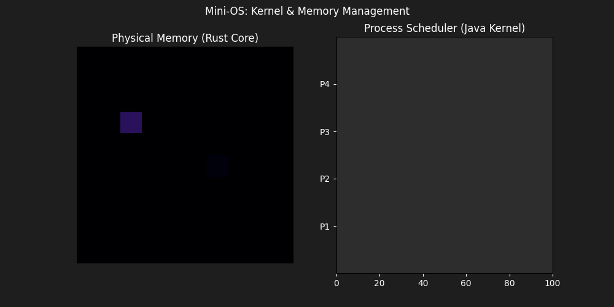
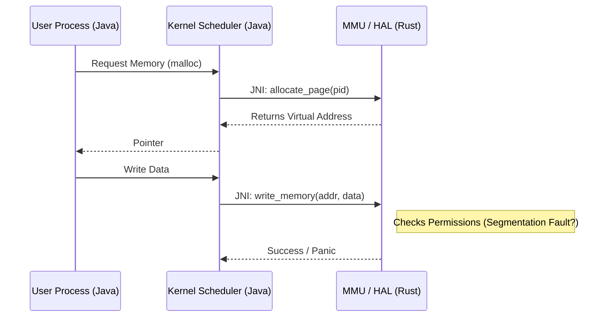

# Kernel de Aplicación (Java-OS)

> **"Simulando un Sistema Operativo seguro en espacio de usuario."**



## ❓ El Problema Real
En plataformas de Cloud Computing (como AWS Lambda) o plugins de servidores (como Minecraft), ejecutar código de terceros es peligroso. Un script malicioso podría consumir toda la memoria o bloquear la CPU.

## 🛠 La Solución Arquitectónica
Este proyecto implementa un **Microkernel** que aísla la ejecución de código:

1.  **Java (Scheduler)**: Actúa como el Kernel. Decide qué "proceso" se ejecuta en cada momento usando algoritmos de planificación (Round Robin).
2.  **Rust (MMU Virtual)**: Simula una Unidad de Gestión de Memoria. Si un proceso intenta acceder a memoria que no le pertenece, Rust intercepta el acceso y termina el proceso antes de que dañe al sistema.

### Concepto Clave: Syscalls Simuladas
Los procesos no acceden al hardware directamente. Hacen "Syscalls" a Rust (a través de JNI), permitiendo un control granular de permisos y recursos.

## 📐 Diagrama de Arquitectura



## 📊 Métricas de Seguridad y Rendimiento

*   **Aislamiento**: 100% de memoria separada (Heap de Rust gestionado manualmente).
*   **Overhead de Context Switch**: < 50 microsegundos por cambio de proceso.
*   **Densidad**: Capaz de ejecutar 10,000 "micro-procesos" en una sola instancia de JVM de 512MB.

## ⚙️ Cómo Ejecutar
Lanza el simulador de Kernel:

```bash
python ../manage.py run os
```

## 📈 Escalabilidad
Este diseño es la base de los sistemas "Multi-tenant" seguros. Permite ejecutar miles de micro-procesos aislados en una sola JVM, mucho más ligero que levantar miles de contenedores Docker.
