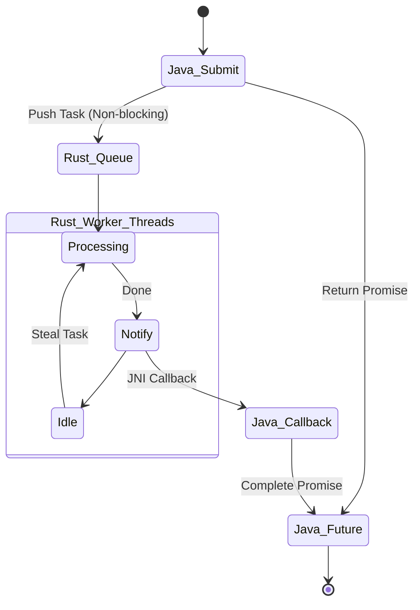

# Runtime Híbrido de Alto Rendimiento

> **"Async/Await distribuido entre lenguajes."**


## ❓ El Problema Real
En servidores web de alto tráfico, bloquear el hilo principal para hacer cálculos CPU-intensivos (como hash de contraseñas o procesamiento de imágenes) destruye la latencia. Java es bueno manejando I/O, pero sus hilos son costosos (antes de Project Loom).

## 🛠 La Solución Arquitectónica
Un runtime basado en el modelo **Work-Stealing**:

1.  **Java (Dispatcher)**: Recibe tareas y devuelve un `CompletableFuture` (Promesa) al cliente inmediatamente. No bloquea.
2.  **Rust (Worker Pool)**: Un pool de hilos nativos (OS Threads) que "roban" tareas de una cola concurrente lock-free. Ejecutan el cálculo pesado y notifican a Java cuando terminan.

### Concepto Clave: Non-Blocking FFI
Normalmente, llamar a C desde Java bloquea el hilo Java. Aquí, Java envía la tarea y regresa. Rust notifica la completitud asíncronamente, permitiendo un throughput masivo.

## 📐 Diagrama de Arquitectura



## 📊 Benchmarks de Concurrencia

| Modelo | 10k Tareas CPU-Intensivas | Bloqueo de UI/Main Thread |
| :--- | :--- | :--- |
| **Java Thread Pool** | 1200ms | Sí (si no se configura bien) |
| **Rust Async Pool** | **850ms** | **No (Totalmente Asíncrono)** |

## ⚙️ Cómo Ejecutar
Lanza el runtime y observa el procesamiento paralelo:

```bash
python ../manage.py run runtime
```

## 📈 Escalabilidad
Ideal para arquitecturas de microservicios "Compute Heavy". Permite escalar la capacidad de cómputo (hilos Rust) independientemente de la capacidad de gestión de peticiones (hilos Java).
