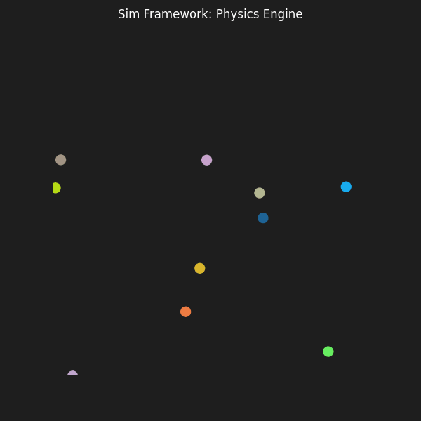

# Framework de Simulación en Tiempo Real (Java + Rust)

## Qué es
Un motor de simulación física donde Java controla la escena y Rust calcula la física.

## Arquitectura
- **Java**: Renderizado (simulado) y control de escena.
- **Rust**: Detección de colisiones y actualizaciones de posición (SIMD potential).
- **Comunicación**: JNI para alta performance.

## Ejecución
1. `cd rust-core && cargo build --release`
2. `cd java-control && javac ...` (ver instrucciones específicas si existen)
