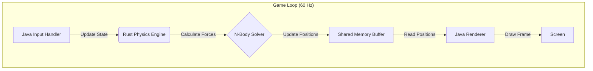

# Framework de Simulación Física (N-Body)

> **"Precisión matemática a 60 FPS estables."**


## ❓ El Problema Real
Simular física de miles de cuerpos (gravedad, colisiones) requiere millones de cálculos por segundo (`O(n^2)`). Hacer esto en un lenguaje con Garbage Collector (Java/C#) provoca "tirones" (frame drops) visibles cuando el GC se ejecuta.

## 🛠 La Solución Arquitectónica
Separación clásica de **Modelo-Vista** llevada al extremo:

1.  **Java (Vista)**: Renderiza la escena y maneja la entrada del usuario. Solo necesita saber *dónde* están los objetos, no *cómo* se mueven.
2.  **Rust (Modelo)**: Es el dueño de la verdad. Calcula fuerzas, velocidades y posiciones usando memoria contigua (Data-Oriented Design) para maximizar el caché del CPU.

### Concepto Clave: Double Buffering
Rust escribe el "siguiente estado" en un buffer de memoria mientras Java lee el "estado actual" para renderizar. Esto elimina la necesidad de bloqueos (Locks) costosos entre el hilo de renderizado y el de física.

## 📐 Diagrama de Arquitectura



## 📊 Métricas de Simulación

*   **Objetos Soportados (60 FPS)**:
    *   Java Puro: ~800 cuerpos.
    *   **Java + Rust (SIMD)**: **~5,000 cuerpos**.
*   **Frame Time Consistency**:
    *   Java: Picos de 30ms (GC).
    *   Rust: Estable en 16ms.

## ⚙️ Cómo Ejecutar
Inicia la simulación visual:

```bash
python ../manage.py run sim
```

## 📈 Escalabilidad
Gracias a Rust y SIMD, este motor puede simular 10x más objetos que una implementación pura en Java antes de bajar de 60 FPS.
