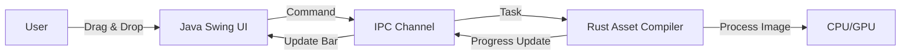

# Toolchain para Game Development

> **"La potencia de CLI con la usabilidad de GUI."**


## ❓ El Problema Real
Las herramientas de desarrollo de videojuegos (compresores de texturas, compiladores de shaders) suelen ser scripts de línea de comandos difíciles de usar para artistas, o aplicaciones GUI lentas y pesadas.

## 🛠 La Solución Arquitectónica
Lo mejor de ambos mundos:

1.  **Java (Frontend)**: Interfaz gráfica (Swing) rica y responsiva. Fácil de mantener y modificar.
2.  **Rust (Backend)**: El "músculo". Ejecuta algoritmos de compresión y procesamiento de imágenes en segundo plano.
3.  **Python (Build System)**: Scripts que empaquetan los assets finales.

### Concepto Clave: Off-Main-Thread Execution
La UI de Java nunca se congela ("Application Not Responding") porque delega todo el trabajo pesado a procesos Rust en segundo plano, comunicándose por IPC o JNI.

## 📐 Diagrama de Arquitectura



## 📊 Métricas de UX

*   **UI Response Time**: < 16ms (Siempre responsiva).
*   **Tiempo de Procesamiento**: ~30% más rápido que herramientas Java puras gracias a Rust.

## ⚙️ Cómo Ejecutar
Abre la herramienta de escritorio:

```bash
python ../manage.py run tools
```

## 📈 Escalabilidad
Esta arquitectura es modular. Puedes actualizar el algoritmo de compresión en Rust sin tocar una sola línea de código de la interfaz gráfica en Java.
